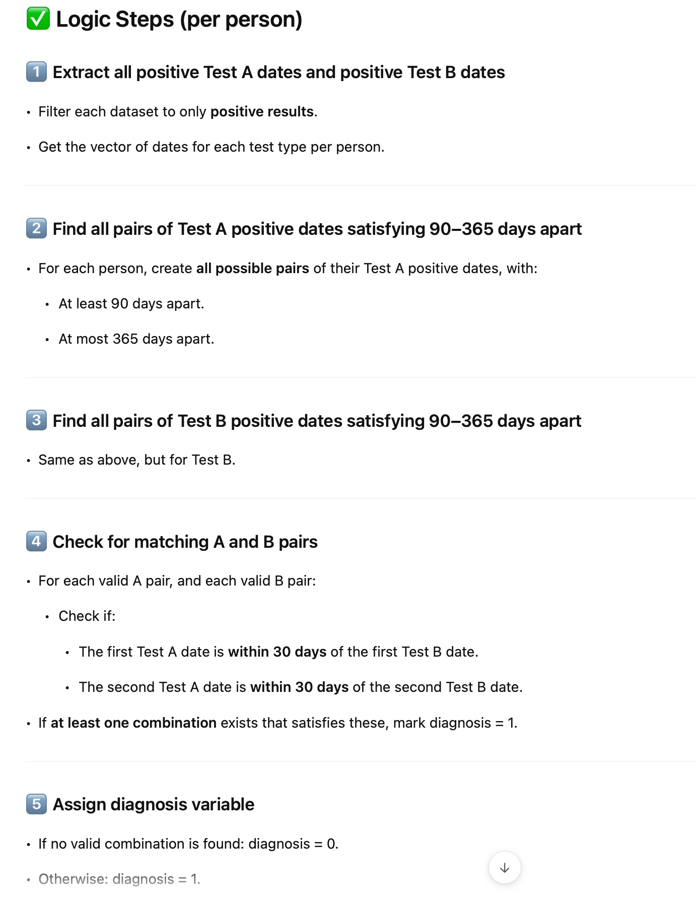
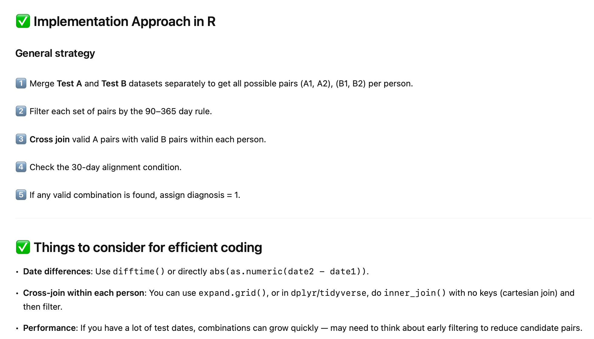

# Diagnosis Algorithm Repository

A lightweight R implementation of a diagnosis algorithm based on paired positive test results (Test A and Test B). This repository includes example data, the core function implementation, visualization scripts, an alternative SQL-based implementation, and a suite of tests for edge and missing-case scenarios.

## Repository Structure

```
├── example data and function use.R       # Example dataset and algorithm implementation
├── visualize data set.R                 # Visualization of test dates and diagnoses
├── testing - edge cases.R               # Edge-case tests for boundary conditions
├── testing - missing cases.R            # Tests for scenarios with insufficient data
├── alternative implementation using SQL.R  # Runs the SQL-based diagnosis and compares to R output
├── doc_logic.png                        # Flowchart of the diagnostic logic
├── doc_algorithm.png                    # Diagram of the algorithm implementation
└── README.md                            # This documentation
```

## Prerequisites

- **R** (version >= 4.0)
- **R packages**:
  - tidyverse

Install required packages:
```r
install.packages("tidyverse")
```

## Usage

1. **View and run the example implementation**
   - The file **`example data and function use.R`** contains simulated example data, the core `assign_diagnosis()` function, and sample calls illustrating how to assign diagnoses to a data frame of test results.

2. **Explore the visualization script**
   - **`visualize data set.R`** shows how to generate a timeline plot of Test A and Test B positive dates for each person, including the highlighting of the diagnosis‑defining pairs.

3. **Run the tests for edge cases**
   - **`testing - edge cases.R`** defines a series of controlled scenarios at the 90‑day/365‑day boundaries and alignment edges to verify the algorithm behaves correctly at the limits.

4. **Run the tests for missing data**
   - **`testing - missing cases.R`** covers scenarios where individuals lack sufficient positive tests (only one A or B, or none), ensuring the function returns `diagnosis = 0` in these cases.

5. **Review the SQL-based implementation**
   - **`alternative implementation using SQL.R`** demonstrates how to replicate the same diagnosis logic inside DuckDB or Redshift, and compares the SQL results against the R implementation.

## Documentation

- **Diagnostic logic flowchart**: `doc_logic.png`

  

- **Algorithm implementation diagram**: `doc_algorithm.png`

  

## Contributing

Contributions are welcome! Please open an issue or submit a pull request for bug fixes, enhancements, or additional test cases.

## License

This project is licensed under the MIT License. See [LICENSE](LICENSE) for details.
